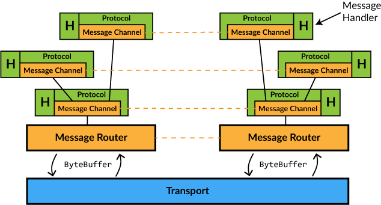

# Arteria

## Introduction

Primary motivation for Arteria is to have a high performance messaging system between two separate threads in an application, especially between the UI thread
and Web Workers in a browser application. The focus on _intra_ process communication sets Arteria apart from other messaging libraries that gear towards network
communication. Having said that, it is entirely possible to use Arteria also for network communication using, for example, WebSockets or plain old TCP.

In addition to high performance messaging, Arteria has following design goals:

1. Hierarchical message channels (a channel can create sub-channels)
2. Easy serialization of user data into messages
3. Type safe channel protocol

## Architecture

The architecture of Arteria is built on a hierarchy of _message channels_. At the root there is a special channel, the `MessageRouter`, that performs the actual
communication with another instance of `MessageRouter` for all the channels. On top of the router you can have one or more layers of application message
channels sending messages back and forth.

Arteria core doesn't provide the actual _transport_ between the routers, just a binary stream of data, allowing users to choose appropriate transport
implementation according to their needs. This also implicates that the flow of messages is inherently tied to the transport triggering a _flush_ on the router
to get the backlog of messages to send.

The serialization of messages travelling on the channels is performed by [BooPickle](https://github.com/ochrons/boopickle), which provides highly optimized
pickling utilizing an efficient binary stream format. The stream is converted into/from a `ByteBuffer` for transportation.

Each `MessageChannel` is associated with a _protocol_ providing type safety and symmetrical serialization for the messages on that channel. The protocol also
defines the types needed for materializing and initializing the channel on the other side.

Finally every channel has a user defined _handler_ that is called for each received message and for other things that require action from the application.
